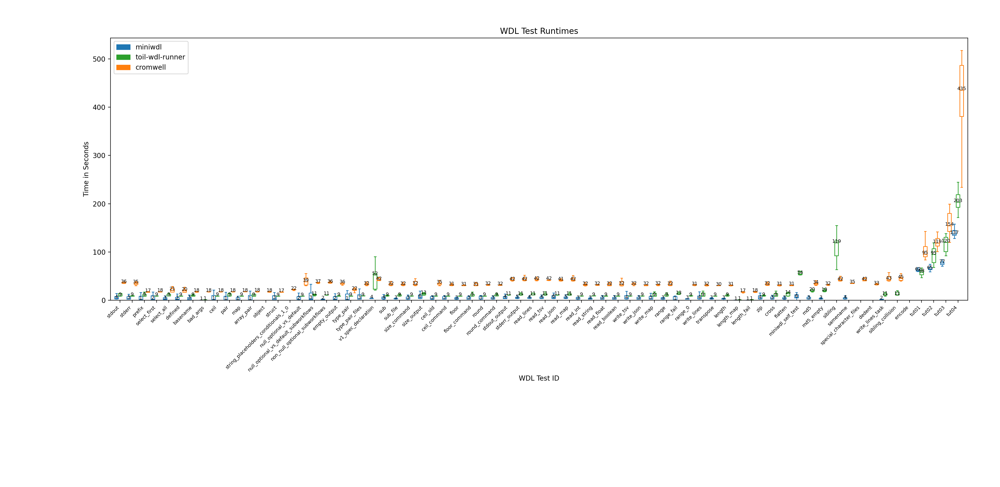
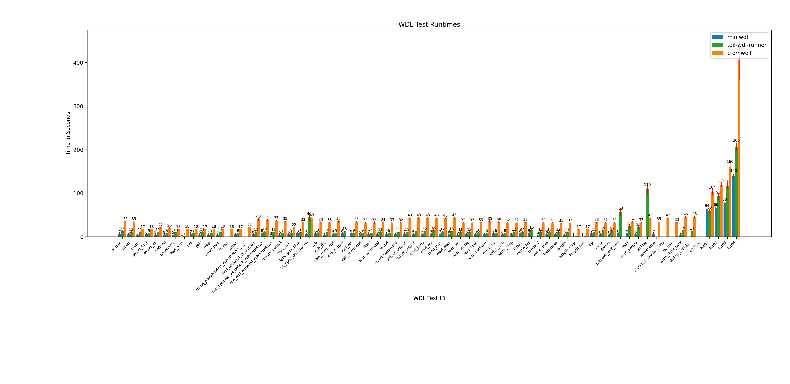

# WDL (Workflow Description Language) Spec Conformance Tests

Now run WDL Spec Conformance Tests from the comfort of your own environment!  With the
comfort of your own runner!

Designed to be run by any WDL-supporting runner, these tests aim to cover
the entire WDL spec eventually.  Running these tests should not only test a runner's
level of compliance with any given version of the WDL spec, running them regularly 
should also help to ensure that that level of compliance is maintained.

Supported WDL spec versions:

 - [WDL Version "draft-2"](https://github.com/openwdl/wdl/tree/main/versions/draft-2)
 - [WDL Version 1.0](https://github.com/openwdl/wdl/tree/main/versions/1.0)
 - [WDL Version 1.1](https://github.com/openwdl/wdl/tree/main/versions/1.1)

Runners this has been evaluated against:

 - [Toil](https://github.com/DataBiosphere/toil)
 - [miniwdl](https://github.com/chanzuckerberg/miniwdl)
 - [Cromwell](https://github.com/broadinstitute/cromwell)

## Note

The tests in this directory are incomplete and are in the process of being added to.  If you'd like 
to help make these tests more complete, we gladly welcome PRs!

## Usage

```
(venv) quokka@qcore ~/$ python3 run.py --runner toil-wdl-runner --versions 1.1
Testing runner toil-wdl-runner on WDL versions: 1.1

0: SKIPPED: Standard Lib: Basic test for stdout()
1: SKIPPED: Standard Lib: Basic test for stderr()
2: SUCCEEDED: Standard Lib: Basic test for quote()
3: SUCCEEDED: Standard Lib: Basic test for squote()
4: SUCCEEDED: Standard Lib: Basic test for sep()
5: SUCCEEDED: Standard Lib: Basic test for prefix()

...

...

17 tests run, 15 succeeded, 2 failed, 8 skipped
```


## Options

```
(venv) quokka@qcore ~/$ python3 run.py --help
usage: run.py [-h] [--verbose] [--versions VERSIONS] [--tags TAGS]
              [--numbers NUMBERS] [--runner RUNNER] [--threads THREADS]

Run WDL conformance tests.

options:
  -h, --help            show this help message and exit
  --verbose             Print more information about a test
  --versions {1.0,1.1,draft-2}, -v {1.0,1.1,draft-2}
                        Select the WDL versions you wish to test against.
  --tags TAGS, -t TAGS  Select the tags to run specific tests
  --numbers NUMBERS, -n NUMBERS
                        Select the WDL test numbers you wish to run. Can be a comma separated list or hyphen separated inclusive ranges. Ex: -n=1-4,6,8-10
  --runner RUNNER, -r RUNNER
                        Select the WDL runner to use.
  --threads THREADS     Number of tests to run in parallel. The maximum should be the number of CPU cores (not threads due to wall clock timing).
  --time                Time the conformance test run.
  --quiet
  --exclude-numbers EXCLUDE_NUMBERS
                        Exclude certain test numbers.
  --toil-args TOIL_ARGS
                        Arguments to pass into toil-wdl-runner. Ex: --toil-args="caching=False"
  --miniwdl-args MINIWDL_ARGS
                        Arguments to pass into miniwdl. Ex: --miniwdl-args="--no-outside-imports"
  --cromwell-args CROMWELL_ARGS
                        Arguments to pass into cromwell. Ex: --cromwell-args="--options=[OPTIONS]"
  --id ID               Specify WDL tests by ID.
  --repeat REPEAT       Specify how many times to run each test.
  --jobstore-path JOBSTORE_PATH, -j JOBSTORE_PATH
                        Specify the PARENT directory for the jobstores to be created in.
  --progress            Print the progress of the test suite as it runs.

```
Invoking `run.py` with no options will result in the entire test suite being run, which can take a long time.
Including `--progress` is recommended when running over a long period of time.

The tests to run can be specified with `--id`, `--tags`, and `--numbers`. Tests matching any of the selectors will be run:
```commandline
python run.py --number 1 --id md5 --tags stderr --version 1.0 --runner toil-wdl-runner
Testing runner toil-wdl-runner on WDL versions: 1.0


=== REPORT ===

1: SUCCEEDED: Standard Lib: Basic test for stderr()
Iteration: 1
40: SUCCEEDED: Legacy test for stderr_as_output
Iteration: 1
68: SUCCEEDED: MD5 test
Iteration: 1
3 tests run, 3 succeeded, 0 failed, 0 skipped
```
`--repeat` specifies how many times to run each test. `--threads` allows multiple tests to run simultaneously;
this should be set to no more than the number of physical, highest-performance cores in the system (not counting any efficiency cores or the two logical cores per physical core provided by hyperthreading), in order to ensure consistent timings, if running with `--time` or with the performance testing script.

By default, runner logs are only printed for failed tests. `--verbose` forces logs to always print and `--quiet` forces logs to never print.

If running tests on a cluster, [extra arguments may be necessary](SLURM_README.md).
## Adding Tests
Tests can be added by editing `conformance.yaml`.

For example, a new test can be added as follows:
```yaml
- description: |
    Example new test description
  versions: ["draft-2", "1.0", "1.1"] # specify versions to run with
  id: example_test_id # unique ID of test, no 2 tests should have the same id
  tags: ["examples", "behavior"] # specify tags, these don't need to be unique
  inputs:
    dir: tests/example_files # path to directory where test is, can be an absolute or relative path (to run.py)
    wdl: example.wdl # wdl file name
    json: example.json # json file describing test workflow inputs
  outputs:
    exampleWf.outputVar: # output name, should be workflowName.outputVariable
      type: Boolean # expected output type
      value: True # expected output value
```
The test files then should be under the `tests/example_files` directory and be named `example.wdl` and `example.json`.
Each expected output should be specified as `wfName.varName`. For example, `exampleWf.outputVar` is the specifier if the WDL is this:
```wdl
workflow exampleWf {
    output {
        Boolean outputVar = true
    }
}
```
Only one WDL file is used for all WDL versions that a test runs on; the file [will be rewritten and must obey certain formatting conventions](#test-formatting).
## Test formatting
The test runner uses a single WDL file for each test, written for a single WDL version, to run the test across all applicable WDL versions. This is accomplished by rewriting that one WDL file at runtime to produce generated WDL files targeting the other WDL versions.

Test can use either [automatic formatting](#automatic-formatting) or [manual formatting](#manual-formatting) to be runnable across multiple WDL versions from a single file. If a test uses neither, it must be restricted to a single WDL version.
### Automatic formatting
With automatic formatting, this means that input sections in WDL code must follow the format:
```wdl
input {
    ...
}
```
And command sections must follow the format
```wdl
# same for triple angle braces
command {
    ...
} # line with isolated closing brace indicates end of command section
```
### Manual formatting
If the above format cannot be followed, patch files can be used instead to differentiate from the base file.
The `patch.py` program can be used to do this:
```commandline
python patch.py --version 1.1 --directory tests/basic_stdout
```
The directory `tests/basic_stdout` is the directory that holds all the WDL files written in all versions. The specified version will be the base file to make patch files from.
`--remove` can be provided to delete all other WDL files that aren't the base WDL file, and `--rename` can be used to rename the base WDL file to the same name as the directory.

For example, if `tests/basic_stdout` has 3 WDL files:
```commandline
tests/basic_stdout
├── basic_stdout.json
├── basic_stdout_version_1.0.wdl
├── basic_stdout_version_1.1.wdl
└── basic_stdout_version_draft2.wdl
```
After `python patch.py --version 1.1 --directory tests/basic_stdout` is called, then `patch.py` will use `basic_stdout_version_1.1.wdl` as the base file for patches, and generate 2 patch files to convert from WDL 1.1 to 1.0 and WDL 1.1 to draft-2.
```commandline
tests/basic_stdout
├── ...
├── version_1.0.patch
└── version_draft-2.patch
```
These patch files will be used to create the proper versioned WDL file at runtime (This will take priority over the automatic WDL version conversion).

## Running Performance Tests
The default runner `run.py` only runs tests and reports on their status in the terminal.
To store the runtime of tests (and eventually graph them), the script `run_performance.py` should be used:
```commandline
python run_performance.py --runners toil-wdl-runner,miniwdl --output performance_output.csv --progress
```
The output will always be in CSV format. `--runners` can specify a comma separated list of runners to test, and `--all-runners` is a shortcut to specify all of them.

### Performance Testing Options
[All options](#options) from the normal `run.py` script are also available in `run_performance.py`. For example, if `--id stdout` is provided, then only the `stdout` test will be measured.

The performance test specific options are:
```commandline
Arguments for running WDL performance tests:
  --output OUTPUT, -o OUTPUT
                        Specify the output CSV file.
  --all-runners, -a     Specify whether to run with all runners. This will override the --runners argument.
  --runners RUNNERS     Specify multiple runners in a comma separated list.
```

## Graphing Performance Tests
The script `create_graph.py` can be used to graph the output of the performance tests:
```commandline
python create_graph.py -f performance_output.csv
```
If no input CSV file is given, then the program will run the entire performance test suite first.
### Graph Options
Similar to the performance testing script, [all options](#options) from the base runner are carried through. However, there are graphing specific options:
```commandline
Arguments for graphing runtimes of WDL tests:
  --from-file FILE, -f FILE
                        Specify a csv file to read from.
  --display-num DISPLAY_NUM, -d DISPLAY_NUM
                        Specify the number of tests to display per graph.
  --display-all, -a     Display all tests on a single graph. Overrides --display-num.
  --ignore-runner IGNORE_RUNNER
                        Specify a runner(s) to ignore in the graph output.
  --precision PRECISION
                        Specify the precision when outputting float values. Ex: Default=0 will result in 1 for float value 1.4...
  --no-labels           Specify to not display extra labels on the graph.
  --graph-type GRAPH_TYPE
  --conformance-file [CONFORMANCE_FILE]
                        Specify the conformance file to read from. This will specify whether to grab/graph tests by conformance file or by CSV file test IDs only. Specifying this will make the graph accept -n, -t, -id and
                        other related arguments.
```
By default, separate graphs will be created for every 30 tests.

This can be controlled with `--display-num`, which overrides the number of tests to display per graph. `--display-all` forces all tests in a single graph.

`--graph-type` specifies the type of graph to create. The supported options are `box` and `bar`.
`box` will create a traditional box plot and `bar` will create a bar graph with error bars representing standard deviation. 
### Writing Graphs to a File
The graphs can be written to disk by specifying a (base) filename.

For example, to output a graph with all tests in a PNG with a size of 40 inches by 10 inches (width,height):
```commandline
python create_graph.py -f performance_output.csv --output performance_graph.png --dimensions 40,10 -a
```
If `--display-all` is not specified and there are more tests to graph than `--display-num`, then multiple graph files will be created with the format `[output_file][iteration].[fileext]`.

For example, calling `python create_graph.py -f performance_output.csv --output performance_graph.png` with 90 total tests to graph will result in:
```commandline
.
├── performance_graph1.png
├── performance_graph2.png
└── performance_graph3.png
```
If trying to put all the tests into a single graph, it is likely that dimensions should be provided to make all tests fit.

All output formats implemented by Matplotlib (such as `pdf` and `svg`) are supported.
### Graph Output Options
Other than the previous [general](#options) and [graph specific](#graph-options) options, the options for outputting a graph are:
```commandline
Arguments for specifying how to write the graph to a file.:
  --output OUTPUT, -o OUTPUT
                        Instead of displaying the graphs, output it into an image. If --display-num is set to a number less than the total amount of tests in the CSV file, then multiple images will be created with the naming
                        scheme: [filename][iteration].[fileextension]. For example, if wdl_graph.png is passed, then the first file created will be wdl_graph1.png.
  --dimensions [DIMENSIONS]
                        If custom dimensions are needed, this can be called with input format x_size,y_size in inches. Calling this with no value will size the graph accordingly.
```
### Example Graphs
These are 2 graphs generated from running performance testing on a SLURM cluster.


